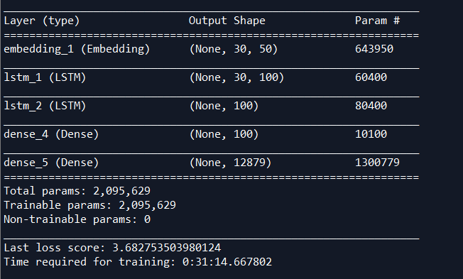
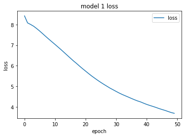

## Objective

The goal of this assignment is to use RNN to predict headlines for news. Parameter selection and model optimization are implemented to find the base model, and different model were trained to see the effect of parameters. Checkpoints were set to find out how the model trained with epochs increasing.

## Data Prepocessing

The dataset is a csv file with over 1 million rows, in order to reduce the time cost and memory used to train the model, I selected 10 thousand of rows, and removed the column ‘publish-data’ because it’s irrelevant to our target. 
Then I transformed and trimmed the data. Because my model is learning by word, so I created mapping of unique words to integers. Then, I created sequence of words as X, and the word right next to the sequence as Y by iterating the whole text. My prediction was based on comparing different probabilities of words being the next words given a sequence of words.
Finally, I reshaped and normalized the X variable, and transformed the Y into categorical variable

## Model Selection:
The model that I used was a LSTM model with 2 dense layer, 2 LSTM layer with dropout rate equal to 0.2 after each layer included embedding method.
For each LSTM layer, it has 100 hidden units. The output layer is a dense layer with ‘softmax’ activation function, which is used for multi-class classification problem. I set the sequence length as 30, and the number of epochs as 50, the batch size as 128, also I set checkpoint after every 10 epochs to monitor how the loss of the model changes over time. 

## Base Model

- Bulleted
- List

Number of epoch	Seed	Predicted headline
10	 nuclear isotopes run low after reactor shutdown	to be mccarthy police police police police police
20	investment banker denies lying at icac	bloom dies on the driving case in missing
30	build sports stadium opposition	police slowdown league trump minister slams fremantle penalty
40	witnesses praised for apprehending alleged	rattles cup bomber implications reaction matthewson trump police
50	mitsubishi workers urged to accept redundancy	and attempted court hears of bunbury year choppers

## Parameter selection

There are many ways for parameter selection, here I tried to change the following parameters: the number of units, the number of layers, sequence length etc. And each time, I tired to compare the loss of the models. And finally I arrived at our final model.

## Final Model

